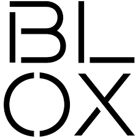
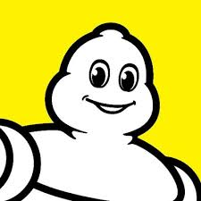

<!DOCTYPE html>
<html lang="en">
<head>
  <meta charset="UTF-8">
  <meta name="viewport" content="width=device-width, initial-scale=1.0">
  
  <!-- Primary Meta Tags -->
  <meta name="title" content="Brandon King">
  <meta name="description" content="I design Mechanical systems and hardware with manufacturing in mind . // @BrandonKing">
  <meta name="keywords" content="Digital fabrication, PCB development, Mechatronics engineering, USC Iovine and Young Academy, Engineering design, Fab Academy, Hardware engineering, Rapid prototyping, CAD design, Physical computing, Electronics design, IoT development, Wearable technology, Engineering portfolio">
  <meta name="author" content="Brandon King">
  <meta name="robots" content="index, follow">
  
  <!-- Open Graph / Facebook -->
  <meta property="og:type" content="website">
  <meta property="og:url" content="/">
  <meta property="og:title" content="Teddy Warner">
  <meta property="og:description" content="Teddy Warner's Personal Website">

  <!-- Twitter -->
  <meta property="twitter:card" content="summary_large_image">
  <meta property="twitter:url" content="/">
  <meta property="twitter:title" content="Brandon King">
  <meta property="twitter:description" content="I use digital fabrication techniques to accelerate human centric design. // @WarnerTeddy">
  <meta property="twitter:image" content="">

  <link rel="preconnect" href="https://fonts.googleapis.com">
  <link rel="preconnect" href="https://fonts.gstatic.com" crossorigin>
  <link href="https://fonts.googleapis.com/css2?family=Crimson+Pro:ital,wght@0,200..900;1,200..900&display=swap" rel="stylesheet">
  <link href="https://fonts.googleapis.com/css2?family=Crimson+Pro:ital,wght@0,200..900;1,200..900&family=JetBrains+Mono:ital,wght@0,100..800;1,100..800&display=swap" rel="stylesheet">
  
  
  <link rel="stylesheet" href="/assets/css/index.css">
  <link rel="stylesheet" href="/assets/css/header.css">
</head>

<body>

  <nav class="main-navigation">
    <ul>
      <li><a class="home" href="/">01 Home</a></li>
      <li><a class="proj" href="/proj/">02 Projects</a></li>
      <li><a class="proj" href="/resume">03 Resume</a></li>
    </ul>
  </nav>
  
  

  <main data-scroll-container>
  

    <section class="intro-section">
      

        

          <h2>Hey! I'm <a id="twittername" target="_blank" href="https://x.com/brandonkxo">Brandon</a>, </h2>
        

      

    </section>
    <section class="mobile-video-hero">
      <a href="https://www.deshazo.com/automation" target="_blank" class="mobile-video-link">
        <video autoplay muted loop playsinline poster="assets/images/Deshazo/Deshazo 1.jpg" aria-label="Deshazo Automation project video">
          <source src="assets/images/Deshazo/DeshazoVideo1.mp4" type="video/mp4">
        </video>
      </a>
    </section>
    <section class="featured-projects">
        

            

                

                    <svg viewBox="0 0 1440 1024" preserveAspectRatio="none" fill="none" xmlns="http://www.w3.org/2000/svg">
                        <defs>
                            <clipPath id="clip0_107_71">
                                <rect x="804.5" y="624" width="226" height="272" rx="21" />
                            </clipPath>
                            <clipPath id="clip1_107_71">
                                <rect x="142" y="212" width="468" height="288" rx="26" />
                            </clipPath>
                            <clipPath id="clipImage1">
                                <rect x="1065" y="307" width="225" height="389" rx="112.5" />
                            </clipPath>
                            <clipPath id="clipImage2">
                                <rect x="277.5" y="527" width="492" height="328" rx="21" />
                            </clipPath>
                            <clipPath id="clipImage4">
                                <rect x="151" y="220" width="451" height="273" rx="21" />
                            </clipPath>
                            <clipPath id="clipImageTone">
                                <path d="M847.468 115H819.532H658.601H649.2C645.28 115 643.319 115 641.822 115.763C640.505 116.434 639.434 117.505 638.763 118.822C638 120.319 638 122.28 638 126.2V135.343V470.823V480.8C638 484.72 638 486.681 638.763 488.178C639.434 489.495 640.505 490.566 641.822 491.237C643.319 492 645.28 492.165 649.2 492.165H659.601H749.535H759.685C760.842 492.165 761.42 492.165 761.909 492.176C784.891 492.699 803.397 511.205 803.92 534.187C803.931 534.676 803.931 535.254 803.931 536.411V565.657V575.731C803.931 579.651 804 581.681 804.763 583.178C805.434 584.495 806.505 585.566 807.822 586.237C809.319 587 811.28 587 815.2 587L825.463 586.931L1007.4 587H1017.8C1021.72 587 1023.68 587 1025.18 586.237C1026.5 585.566 1027.57 584.495 1028.24 583.178C1029 581.681 1029 579.72 1029 575.8V565.657V136.343V126.2C1029 122.28 1029 120.319 1028.24 118.822C1027.57 117.505 1026.5 116.434 1025.18 115.763C1023.68 115 1021.72 115 1017.8 115H1007.4H847.468Z" />
                            </clipPath>
                            <clipPath id="clipImageBook">
                                <rect x="796.5" y="616" width="242" height="288" rx="27" />
                            </clipPath>
                            <path id="circlePath" d="M 1137 797 m -50, 0 a 50,50 0 1,1 100,0 a 50,50 0 1,1 -100,0" />
                        </defs>
                        <a href="/proj">
                            <g id="title-group" class="title">
                                <rect x="141" y="143" width="224" height="49" rx="24.5" fill="var(--md-default-bg-color)" />
                                <rect x="141.5" y="143.5" width="223" height="48" rx="24" stroke="var(--md-default-fg-color--lighter)" />
                                <text x="253" y="175" fill="var(--md-default-fg-color--light)" text-anchor="middle" font-family="Crimson Pro" font-size="23" font-style="normal" font-weight="300" line-height="109.588%">Some of my work...</text>
                            </g>
                        </a>
                        <a href="/Projects/ApptronikArmHardware/">
                            <g id="image-card-1" class="project">
                                <rect x="1057" y="299" width="240" height="405" rx="120" fill="var(--md-default-fg-color--lightest)" />
                                <rect x="1057.5" y="299.5" width="239" height="404" rx="119.5" stroke="var(--md-default-fg-color--lighter)" stroke-opacity="0.2" />
                                <image x="1065" y="307" width="235" height="395" href="assets/images/index/ApptronikArm.jpg" clip-path="url(#clipImage1)" preserveAspectRatio="xMidYMid slice" alt="Apptronik Arm project image" />
                            </g>
                        </a>
                        <a href="https://www.deshazo.com/automation">
                          <g id="image-card-2" class="project">
                              <rect x="269.5" y="520" width="508" height="342" rx="26" fill="var(--md-default-fg-color--lightest)" />
                              <rect x="270" y="520.5" width="507" height="341" rx="25.5" stroke="var(--md-default-fg-color--lighter)" stroke-opacity="0.2" />
                              <g clip-path="url(#clipImage2)">
                                <foreignObject x="277.5" y="527" width="492" height="328" xmlns="http://www.w3.org/1999/xhtml">
                                  

                                    <video autoplay muted loop playsinline style="width:100%;height:100%;object-fit:cover;" poster="assets/images/Deshazo/Deshazo 1.jpg" alt="Deshazo project video">
                                      <source src="assets/images/Deshazo/DeshazoVideo1.mp4" type="video/mp4">
                                    </video>
                                  

                                </foreignObject>
                              </g>
                              <rect x="278" y="527.5" width="491" height="327" rx="20.5" stroke="var(--md-default-fg-color--lighter)" stroke-opacity="0.2" />
                          </g>
                        </a>
                        <a href="/projects/FROTHED">
                          <g id="reading-card" class="project">
                              <rect x="790.5" y="610" width="254" height="300" rx="33" fill="var(--md-default-fg-color--lightest)" />
                              <rect x="791" y="610.5" width="253" height="299" rx="32.5" stroke="var(--md-default-fg-color--lighter)" stroke-opacity="0.2" />
                              <image x="796.5" y="616" width="242" height="330" href="/assets/images/index/FROTHEDPrototypeV1.jpg" clip-path="url(#clipImageBook)" preserveAspectRatio="xMidYMid slice" alt="FROTHED Prototype project image" />
                          </g>
                        </a>
                        <a href="/Projects/Microbot/">
                            <g id="image-card-4" class="project">
                                <g clip-path="url(#clip1_107_71)">
                                    <rect x="142" y="212" width="468" height="288" rx="26" fill="var(--md-default-fg-color--lightest)" />
                                    <image x="151" y="220" width="451" height="273" href="assets/images/index/microbotsnap.jpg" clip-path="url(#clipImage4)" preserveAspectRatio="xMidYMid slice" alt="Von Niemann Probe project image" />
                                    <rect x="151.5" y="220.5" width="450" height="272" rx="20.5" fill="none" stroke="var(--md-default-fg-color--lighter)" stroke-opacity="0.2" />
                                </g>
                                <rect x="143.5" y="212.5" width="466" height="287" rx="24.5" fill="none" stroke="var(--md-default-fg-color--lighter)" stroke-opacity="0.2" />
                            </g>
                        </a>
                        <g id="image-card-3">
                                <path d="M848.04 107H818.96H652.485C644.615 107 640.679 107 637.673 108.503C635.029 109.825 632.879 111.935 631.532 114.53C630 117.48 630 121.342 630 129.066V477.986C630 485.71 630 489.572 631.532 492.522C632.879 495.117 635.029 497.227 637.673 498.549C640.679 500.052 644.615 500.052 652.485 500.052H750.262H760.035C780.16 500.052 796.475 516.367 796.475 536.493V572.934C796.475 580.658 796.475 584.52 798.007 587.47C799.354 590.065 801.504 592.175 804.149 593.497C807.155 595 811.09 595 818.96 595H818.96H1014.52H1014.52C1022.39 595 1026.32 595 1029.33 593.497C1031.97 592.175 1034.12 590.065 1035.47 587.47C1037 584.52 1037 580.658 1037 572.934V129.066V129.066C1037 121.342 1037 117.48 1035.47 114.53C1034.12 111.935 1031.97 109.825 1029.33 108.503C1026.32 107 1022.39 107 1014.52 107H848.04Z" fill="var(--md-default-fg-color--lightest)" stroke="var(--md-default-fg-color--lighter)" stroke-opacity="0.2" />
                                <g clip-path="url(#clipImageTone)">
                                    <foreignObject x="638" y="115" width="391" height="472" xmlns="http://www.w3.org/1999/xhtml">
                                        

                                            <model-viewer
                                                id="iam3d-viewer"
                                                src="/assets/misc/0001-000-1200-006_flexspline_158t.glb"
                                                camera-controls
                                                disable-zoom
                                                interaction-prompt="none"
                                                tone-mapping="neutral"
                                                shadow-intensity="0.6"
                                                exposure="0.375"
                                                field-of-view="7.5deg"
                                                camera-orbit="-45deg 75deg auto"
                                                min-camera-orbit="auto 75deg auto"
                                                max-camera-orbit="auto 75deg auto"
                                                style="width:107.5%;height:100%;background:transparent;">
                                            </model-viewer>
                                        

                                    </foreignObject>
                                </g>
                                <path d="M847.468 115H819.532H658.601H649.2C645.28 115 643.319 115 641.822 115.763C640.505 116.434 639.434 117.505 638.763 118.822C638 120.319 638 122.28 638 126.2V135.343V470.823V480.8C638 484.72 638 486.681 638.763 488.178C639.434 489.495 640.505 490.566 641.822 491.237C643.319 492 645.28 492.165 649.2 492.165H659.601H749.535H759.685C760.842 492.165 761.42 492.165 761.909 492.176C784.891 492.699 803.397 511.205 803.92 534.187C803.931 534.676 803.931 535.254 803.931 536.411V565.657V575.731C803.931 579.651 804 581.681 804.763 583.178C805.434 584.495 806.505 585.566 807.822 586.237C809.319 587 811.28 587 815.2 587L825.463 586.931L1007.4 587H1017.8C1021.72 587 1023.68 587 1025.18 586.237C1026.5 585.566 1027.57 584.495 1028.24 583.178C1029 581.681 1029 579.72 1029 575.8V565.657V136.343V126.2C1029 122.28 1029 120.319 1028.24 118.822C1027.57 117.505 1026.5 116.434 1025.18 115.763C1023.68 115 1021.72 115 1017.8 115H1007.4H847.468Z" fill="none" stroke="var(--md-default-fg-color--lighter)" stroke-opacity="0.2" />
                        </g>
                        <a class="circleLink" href="/projects/SPINPlanetaryActuator">
                            <g transform="translate(1137, 775)">
                                <foreignObject x="-50" y="-50" width="100" height="100">
                                    

                                </foreignObject>
                            </g>
                        </a>
                    </svg>
                

            

        

    </section>
    <section class="experience">
      

        <a href="/resume"><h2>What I've Been Up To</h2></a>
        <a target=”_blank” href="https://deshazo.com/automation">
          
Deshazo Automation
</a>
Mechanical Design Engineer

Aug 2025 - Present

        

        <a target=”_blank”>
          
FROTHED
</a>
Founder

Dec 2024 - July 2025

        

        <a target=”_blank” href="https://www.bloxbuilt.com/">
          
BLOX
</a>
Mechanical Engineering Intern

May 2024 - July 2024

        

        <a target=”_blank” href="https://www.instagram.com/uaecocar/">
          
EcoCAR EV Challenge
</a>
Controls Team Lead

Aug 2022 - Sept 2023

        

        <a target=”_blank” href="https://www.michelinman.com/">
          
Michelin
</a>
Manufacturing Engineering Intern

May 2023 - Aug 2023

        

        <a target=”_blank” href="https://www.instagram.com/alabamafsae/">
          
Formula SAE
</a>
Powertrain Engineer
Aug 2021 - Aug 2022

    </section>
    <section class="about">
      

        <h2>About</h2>
        
Mechanical Engineer with a background in robotics and hardware.

        
I've previously worked on self-driving cars, robotic actuators, and consumer hardware.

      

    </section>
    

    <h1 style="display:none;">Engineering Portfolio - Mechanical Design & Hardware Development</h1>
  

  </main>
  
  
  
</body>
</html>