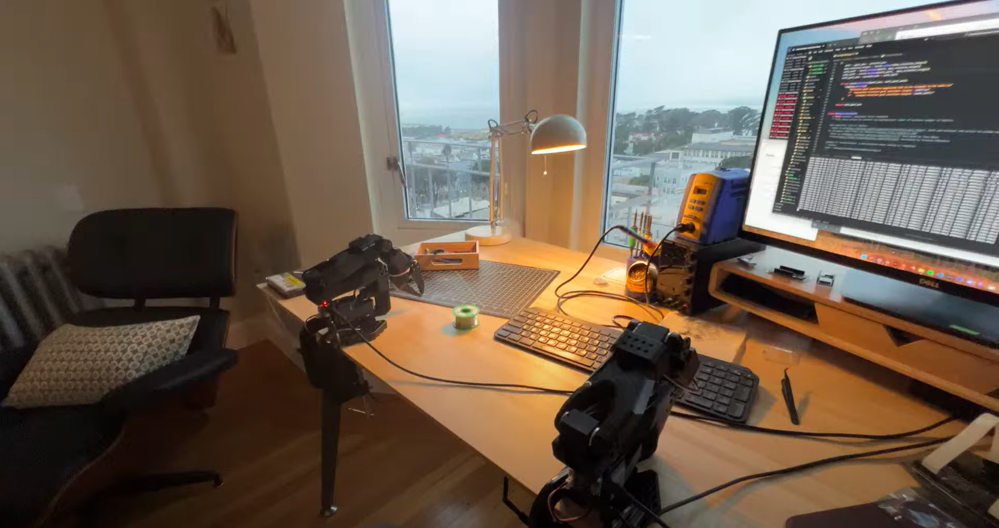
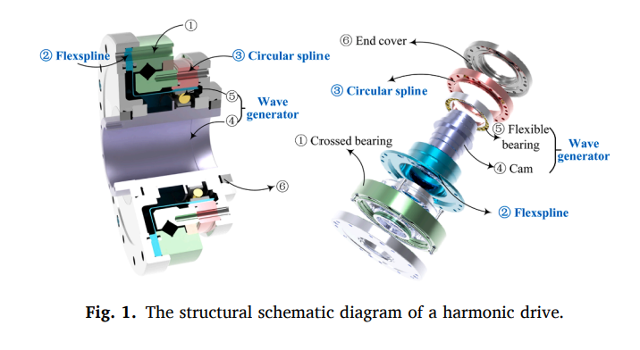
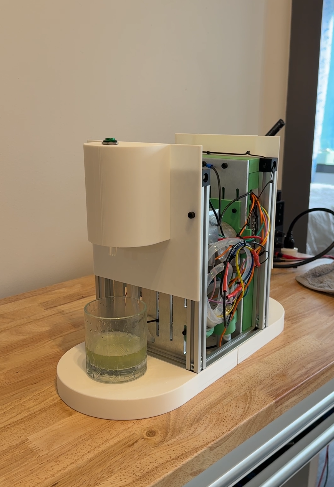
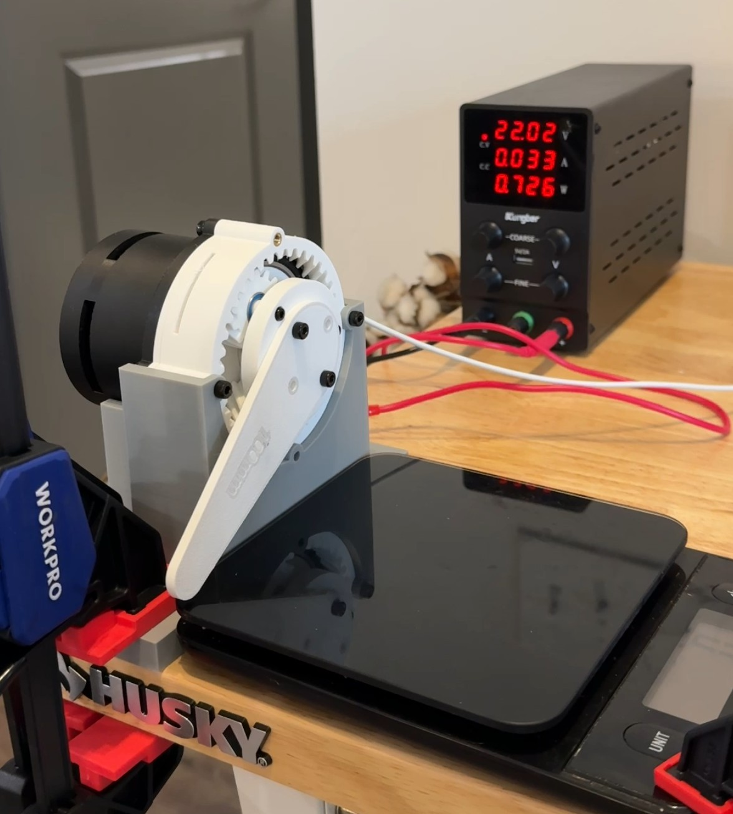
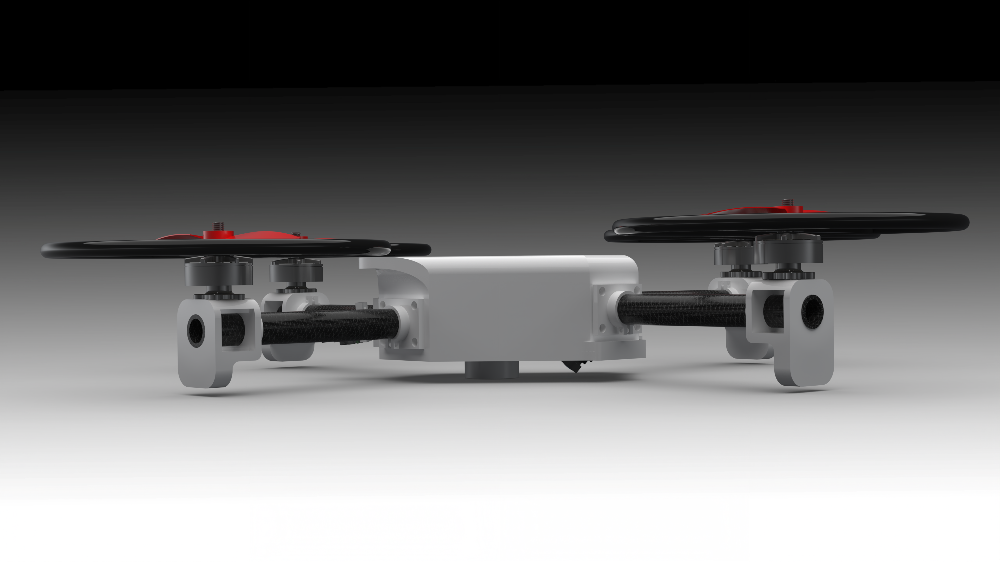
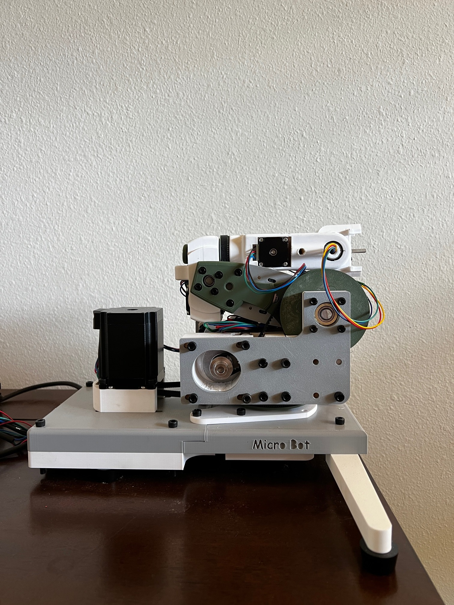
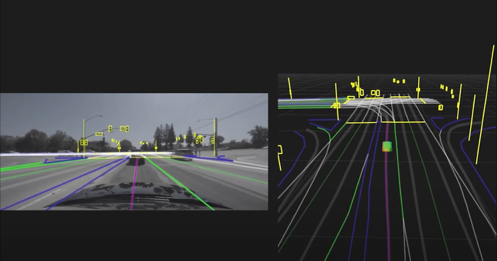
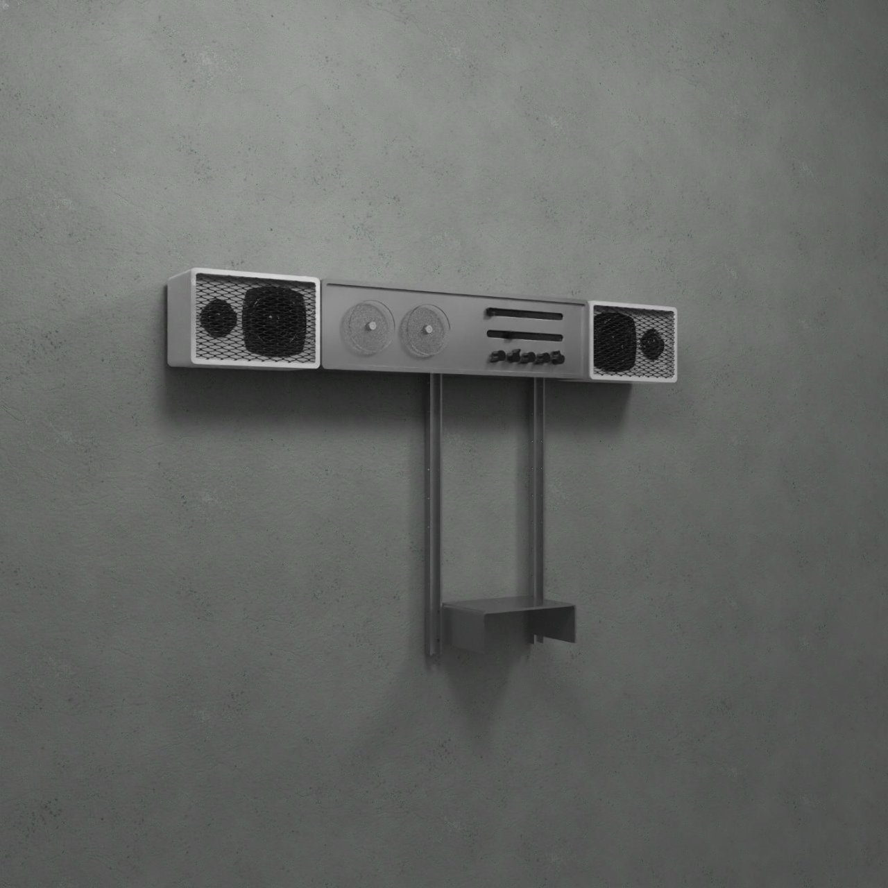

---
hide:
  - navigation
  - toc
  - feedback
template: index.html
search:
  exclude: true
---

<head>
  <meta charset="UTF-8">
  <meta name="viewport" content="width=device-width, initial-scale=1.0">
  
  <!-- Primary Meta Tags -->
  <meta name="title" content="Projects - Brandon King">
  <meta name="description" content="Some of the Open-Source shenanigans I've been up to.">
  <meta name="keywords" content="Digital fabrication, PCB development, Mechatronics engineering, USC Iovine and Young Academy, Engineering design, Fab Academy, Hardware engineering, Rapid prototyping, CAD design, Physical computing, Electronics design, IoT development, Wearable technology, Engineering portfolio">
  <meta name="author" content="Brandon King">
  <meta name="robots" content="index, follow">
  
  <!-- Open Graph / Facebook -->
  <meta property="og:type" content="website">
  <meta property="og:url" content="/proj/">
  <meta property="og:title" content="Projects - Teddy Warner">
  <meta property="og:description" content="Teddy Warner's Projects">
  <meta property="og:image" content="">
  <meta property="og:image:type" content="image/png">
  <meta property="og:image:width" content="1200">
  <meta property="og:image:height" content="630">

  <!-- Twitter -->
  <meta property="twitter:card" content="summary_large_image">
  <meta property="twitter:url" content="/proj/">
  <meta property="twitter:title" content="Projects - Teddy Warner">
  <meta property="twitter:description" content="Some of the Open-Source shenanigans I've been up to.">
  <meta property="twitter:image" content="">

  <!-- Existing resource links -->
  
  <link rel="preconnect" href="https://fonts.googleapis.com">
  <link rel="preconnect" href="https://fonts.gstatic.com" crossorigin>
  <link href="https://fonts.googleapis.com/css2?family=Crimson+Pro:ital,wght@0,200..900;1,200..900&display=swap" rel="stylesheet">
  <link href="https://fonts.googleapis.com/css2?family=Crimson+Pro:ital,wght@0,200..900;1,200..900&family=JetBrains+Mono:ital,wght@0,100..800;1,100..800&display=swap" rel="stylesheet">
  <link rel="stylesheet" href="/assets/css/proj.css">
  <link rel="stylesheet" href="/assets/css/header.css">
</head>

  <nav class="main-navigation">
    <ul>
      <li><a class="home" href="/">01 Home</a></li>
      <li><a class="proj" href="/proj/">02 Projects</a></li>
    </ul>
  </nav>
  
  

<body>
  <main data-scroll-container>
  

    <section class="intro-section">
      

        

          <h2>Project Portfolio</h2>
          <h3>What I've been up to</h3>
        

      

    </section>
    <section class="writing">
      

        <!--

          <a href="https://teddywarner.org/Projects/pi0/">
            

            
Zero-Shot Prompt to Action

            
Spring 2025

            
            
X-X mins

            
            
Zero-shot prompt to action on a $160 3D printed robotic arm with π₀.

          </a>
        

        
-->
        

          <a href="/Projects/HarmonicActuator(MITE)/">
            

            
Harmonic Drive Actuator (MITE)

            
Spring 2026

            
            
—

            
            
Compact harmonic drive actuator

          </a>
        

        

        

        <a href="/Projects/FROTHED/">
          

            

            
FROTHED

            
Dec 2024 - June 2025

            
            
5 mins

            
            
World's first automatic matcha maker

          

        

        

          

          <a href="/Projects/SPINPlanetaryActuator/">
            

            
SPIN Planetary Actuator
            
Fall 2024

            
            
10 mins

            
            
5:1 Quasi-Direct-Drive Actuator 

          </a>
        

        

        

          <a href="/Projects/IAM3DPayloadPickup/">
            

            
IAM3D Payload Pickup Competition

            
Fall 2024

            
            
5 mins

            
            
Racing / Cargo drone - Senior Design

          </a>
        

        

        

          <a href="/Projects/Microbot/">
            

            
MicroBot

            
Winter 2024

            
            
15 mins

            
            
Mini 6DOF arm 

          </a>
        

        

        

          <a href="/Projects/SelfDriving/">
            

            
Self-driving Neural Networks

            
2022-2023

            
            
15 mins

            
            
 Controls Team Lead in charge of implementing level 3 autonomy

          </a>
        

        

        

          <a href="/Projects/ApptronikArmHardware/">
            

            
Apptronik Arm Hardware

            
Spring 2024

            
            
1 min

            
            
Reverse engineered mechanical linkages and mounting points

          </a>
        

        

        

          <a href="/Projects/BraunStereoRedesign/">
            

            
Braun Stereo Redesign

            
Spring 2024

            
            
1 min

            
            
My take on the 1965 Braun HiFi walls stereo. 

          </a>
        

        

        

          <a href="/Projects/BLDC/">
            

            
Integrated Planetary BLDC

            
Spring 2024

            
            
1 min

            
            
9:1 Quasi Direct Drive BLDC

          </a>
        

        

      

    </section>
    <section class="footer">
      

        

          <a target="_blank" href="https://github.com/brandonkxo">
            <i class="fa-brands fa-github"></i>
          </a>
        

        

          <a target="_blank" href="https://x.com/brandonkxo">
            <i class="fa-brands fa-x-twitter"></i>
          </a>
        

        

          <a target="_blank" href="mailto:brandonwkingwi@gmail.com">
            <i class="fa-solid fa-paper-plane"></i>
          </a>
        

        <a target="_blank" href="https://github.com/Twarner491/TeddyWarner.org/blob/main/LICENSE">
          
Copyright © 2025 Brandon King

        </a>
      

    </section>
    <h1 style="display:none;">Project Portfolio - Digital Fabrication & Engineering Projects</h1>
  

  </main>
  
  
  
  
</body>
</html>